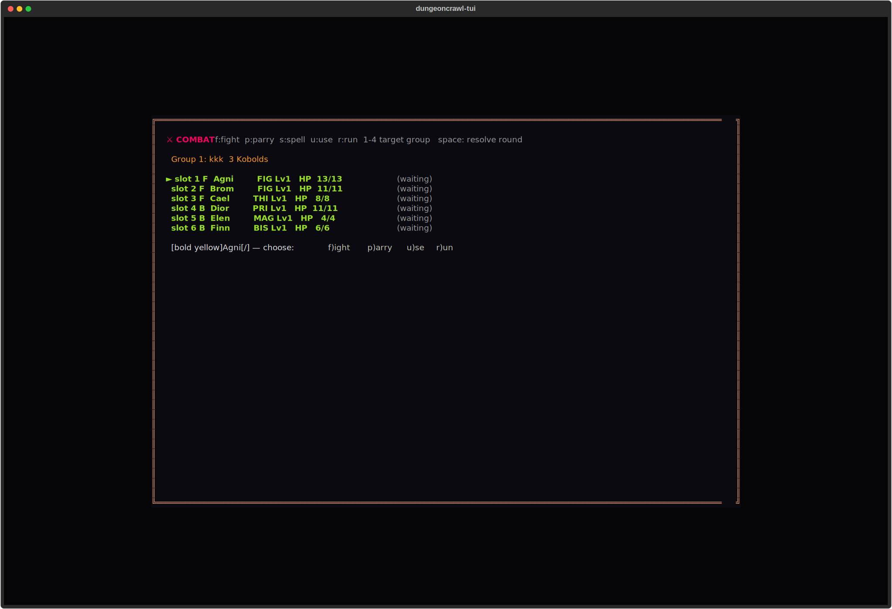
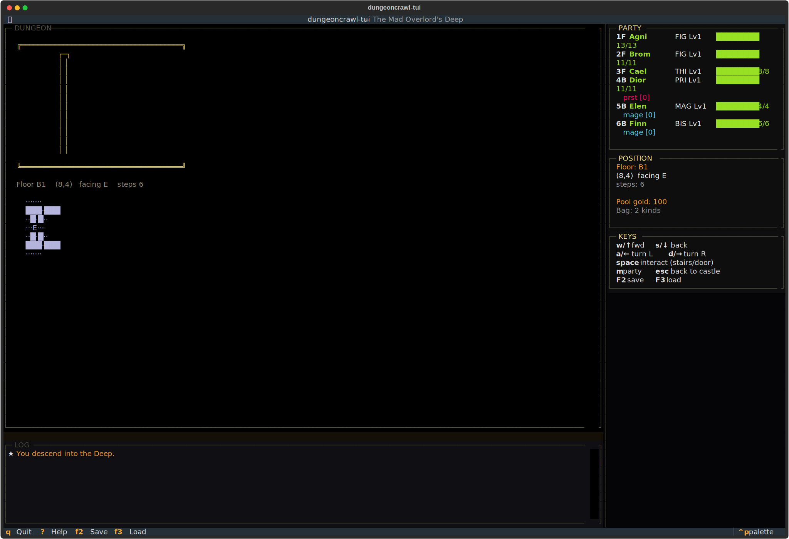

# dungeoncrawl-tui

> Inspired by Wizardry (1981, Sir-Tech). Trademarks belong to their respective owners. Unaffiliated fan project.

Only the prepared return to daylight.




## About
Ten levels deep beneath the castle, Andrew the Unmade waits. Roll a six-adventurer party — fighters, priests, mages, thieves, bishops, maybe a samurai if the dice are kind — and descend. Permadeath is final. Ash is not resurrection. The map fills one step at a time. Touch nothing. Trust no chest. Bring torches. The Mad Overlord's Deep does not forgive.

## Screenshots


## Install & Run
```bash
git clone https://github.com/akakabrian/dungeoncrawl-tui
cd dungeoncrawl-tui
make
make run
```

## Controls
**Castle (default home):**

- `1` Training Grounds (create/review characters)
- `2` Tavern (form party)
- `3` Inn (rest)
- `4` Temple (raise dead)
- `5` Shop
- `6` Descend into the Deep
- `F2`/`F3` save / load
- `?` help

**Dungeon:**

- `W`/`↑` step forward, `S`/`↓` step back
- `A`/`←` turn left, `D`/`→` turn right
- `space`/`enter` interact (stairs, door)
- `M` party status
- `escape` retreat to castle

## Testing
```bash
make test       # QA harness
make playtest   # scripted critical-path run
make perf       # performance baseline
```

## License
MIT

## Built with
- [Textual](https://textual.textualize.io/) — the TUI framework
- [tui-game-build](https://github.com/akakabrian/tui-foundry) — shared build process
